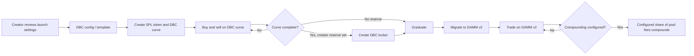

# Met-PAR-4

<p align="center">
	<br /><br />
	<strong>A named-price launch, PAR. A Meteora pool. One title for one real-world asset.</strong><br />
	<a href="https://www.meteora.surf">Open PAR</a> ·
	<a href="https://superteam.fun/earn/listing/meteora-dbc">Meteora DBC track</a> ·
	<a href="https://docs.meteora.ag/developer-guides/dbc">Meteora DBC docs</a>
</p>

PAR is a Solana launch desk built around Meteora’s **Dynamic Bonding Curve (DBC)** and its graduation into **DAMM v2**. Its experiment is a curve with a shelf: instead of making every buyer chase a continuously rising launch price, the creator can set a named opening price, keep at least half of the tokens sold on the curve within a 10% price band, and then walk the remaining curve segment toward the configured graduation price.

The same product can connect a coin to a separately documented real-world asset (RWA). The coin is payment and culture, not equity, not a fractional ownership token, and not a promise of proceeds. A one-of-one title NFT is the claim the creator describes. The creator’s signed record, its on-chain hashes, and its sale page make that distinction visible and inspectable.

> **The idea in one line:** the coin can trade; the title is the claim; Meteora supplies the launch-to-liquidity path.

| | |
| --- | --- |
| **Project** | Met-PAR-4 (PAR) |
| **Live app** | [meteora.surf](https://www.meteora.surf) |
| **Mainnet reference** | [NIGHTMARES pool page](https://www.meteora.surf/pool/2Ea8EspX6PB5HAcECnveCEiPVHqaVm48HQeAXrYLwc4n?c=mainnet) · [mint on Solana Explorer](https://explorer.solana.com/address/9Gfy3oiQTRqCj3CeBqEdRtWoZMMsgAKcfb3jAeQan2N2) |
| **Hackathon track** | [Best use of Meteora’s Dynamic Bonding Curve](https://superteam.fun/earn/listing/meteora-dbc) · Crypto World’s Fair |
| **Core programs** | [Meteora DBC](https://explorer.solana.com/address/dbcij3LWUppWqq96dh6gJWwBifmcGfLSB5D4DuSMaqN) · [Meteora DAMM v2](https://explorer.solana.com/address/cpamdpZCGKUy5JxQXB4dcpGPiikHawvSWAd6mEn1sGG) |
| **Primary networks** | Solana Devnet for practice; Solana Mainnet Beta for real launches |
| **Source access for judges** | This repository is private. Request read access from the project owner. |

<details>
<summary><strong>Contents</strong></summary>

- [Why PAR fits the track](#why-par-fits-the-track)
- [Product tour](#product-tour)
- [The Meteora lifecycle](#the-meteora-lifecycle)
- [What the PAR curve actually guarantees](#what-the-par-curve-actually-guarantees)
- [Fees, migration, and the creator reserve](#fees-migration-and-the-creator-reserve)
- [The RWA record and title](#the-rwa-record-and-title)
- [A safe reviewer walkthrough](#a-safe-reviewer-walkthrough)
- [Architecture](#architecture)
- [Run locally](#run-locally)
- [Tests and current verification limits](#tests-and-current-verification-limits)
- [Boundaries and risks](#boundaries-and-risks)
- [References](#references)

</details>

## Why PAR fits the track

Meteora’s [DBC](https://docs.meteora.ag/developer-guides/dbc) is the launch primitive here, not a decorative integration. PAR builds and signs DBC configuration, creates curve pools, reads and quotes their state, routes pre-graduation trades through the curve, and hands completed pools to Meteora **DAMM v2**. The configured graduation fee, fee schedule, quote asset, optional creator reserve, and optional DAMM v2 fee compounding are part of that launch configuration.

The track asks for meaningful DBC/DAMM v2 use, novel curve or fee design, useful end-to-end launch experiences, and projects with real potential and traction. PAR responds with:

1. **A shelf-shaped DBC launch** for an explicit price-discovery.
2. **A creator-facing launch desk** that turns the chosen settings into a transaction review, then wallet-signed instructions.
3. **The DBC-to-DAMM v2 lifecycle**, including creator-reserve locking where configured and optional post-graduation fee compounding.
4. **An RWA/title workflow** that keeps a tradeable payment coin distinct from a single transferable title NFT and the creator’s written promise.

PAR does **not** currently integrate DLMM or claim to implement every idea in the listing. The work is centered on DBC, DAMM v2, and the optional Meteora locker path.

| Listing’s judging lens | What a reviewer can inspect in PAR |
| --- | --- |
| **Depth of Meteora integration** | The launch configuration, DBC curve trades, DBC-to-DAMM v2 migration, optional locker, and configured fee compounding described below |
| **Technical execution** | Parameter validation, quote-mint checks, transaction review/simulation, wallet signing, on-chain state reads, and hash-linked RWA records |
| **Originality and taste** | The PAR shelf as a price-discovery alternative, plus a deliberately separate coin/payment-token and one-title claim model |
| **Impact potential** | A reusable launch-and-title workflow that can be applied to additional objects and eligible quote assets; this is a design direction, not a claim of scale already achieved |
| **Traction / volume** | The live app and linked Mainnet reference pool; current pool state and volume must be checked directly because they change over time |

## Product tour

### 1. Configure a launch

At [meteora.surf](https://www.meteora.surf), a creator chooses a launch preset or custom settings: supply, opening and graduation prices, quote mint, fee behavior, fee duration, and post-graduation pool settings. The creator reviews the planned configuration and transaction costs before signing. The app separates quote placed into a curve from SOL rent and network fees; creating a pool does not mean the launch quote is already spent.

PAR offers two curve styles:

- **PAR shelf:** a high-weight first segment spans the named opening price to at most 10% above it, followed by a segment that reaches the creator’s graduation price.
- **Regular climb:** the conventional rising-price path, with no shelf segment.

### 2. Trade the curve

Before graduation, the DBC virtual pool is the market. The pool page reads current curve state and prepares buy/sell transactions against DBC. The app supports SOL and USDC presets, plus eligible custom SPL or Token-2022 quote mints subject to Meteora’s quote constraints and badge requirements.

### 3. Graduate into DAMM v2

When a curve is complete, the configured migration path opens a Meteora DAMM v2 pool. Where the launch reserved creator tokens, the DBC locker step must be completed before pool opening. On Devnet, there are no Meteora migration keepers for this app’s practice flow: a wallet completes the locker/open steps and pays the relevant account rent. On Mainnet, eligible pools may be migrated by Meteora keepers; the UI also exposes manual actions where appropriate.

### 4. Optionally attach an object

The asset workflow adds a Master record and a one-of-one Title NFT. The coin and the title remain different assets with different meanings. The Title sale page lets the creator list through Tensor’s marketplace program when the app’s sale conditions allow it; a no-coin RWA can instead use an existing payment token.

## The Meteora lifecycle



| Lifecycle stage | PAR’s role | Meteora surface |
| --- | --- | --- |
| Configure | Builds the selected curve, quote, fee, reserve, and migration parameters for review | DBC SDK configuration builders |
| Create | Requests wallet signatures for the launch template and pool/token creation | DBC `createConfig` / `createPool` transaction builders |
| Curve trading | Reads curve state and builds buy/sell transactions | DBC state, quote, swap instructions |
| Creator reserve | Prepares a lock for reserved creator tokens, when configured | DBC migration locker |
| Graduation | Opens migration to the chosen supported DAMM v2 fee setup | DBC `migrateToDammV2` |
| Post-graduation trading | Reads pool state and builds swaps | DAMM v2 SDK and Solana transactions |
| Fee compounding | Encodes an optional pool-fee compounding mode into the launch config | DAMM v2 migration settings |
| Fee collection | Exposes distinct curve-fee claims and leftover-token actions | DBC partner/creator claim instructions |

The DBC program ID used by the app is `dbcij3LWUppWqq96dh6gJWwBifmcGfLSB5D4DuSMaqN` on both Devnet and Mainnet Beta. DAMM v2’s `cp_amm` program ID is `cpamdpZCGKUy5JxQXB4dcpGPiikHawvSWAd6mEn1sGG`. The project uses Meteora’s DBC SDK, DAMM v2 SDK, and Meteora Lock SDK; see [package.json](package.json).

## What the PAR curve actually guarantees

PAR is deliberately more precise than “most of the supply sells near one price.” Its code constructs two weighted curve segments, caps the shelf at 10% above the opening price, and validates that **at least half of the tokens sold on the curve** fall on that shelf. That validation concerns the curve’s sold tokens, not half of the total token supply, and not a guarantee that any particular quantity will sell.

For the shelf path, the graduation price must be above the shelf and no more than twice the opening price. Presets are calibrated for their documented supply/settings; a custom supply, price, or creator reserve can change the amount that migrates. The UI calculates and displays the result rather than promising a universal migrated percentage.

The regular-climb preset uses a 20% migration-supply parameter. Custom climb settings below 20% produce a warning; they are not all hard-rejected. See the implementation in [src/lib/launch.ts](src/lib/launch.ts) and the DBC parameter builder in [src/lib/curve.ts](src/lib/curve.ts).

## Fees, migration, and the creator reserve

- **Curve fee:** configured at launch and collected in the quote token. It can be flat, fall linearly, or fall exponentially over the supported duration. The optional dynamic/volatility fee is another configuration choice.
- **Fee shares:** the creator/platform split is encoded in DBC configuration and can use platform settings. Meteora’s protocol share is separate. Curve fee claims are separate from the migrated pool’s liquidity and pool fees.
- **Migration fee:** the supported fixed DAMM v2 choices in the standard UI are 0.25%, 0.30%, 1%, 2%, 4%, and 6%. It is selected as part of the launch configuration, not after graduation.
- **Compounding:** when enabled, the launch configuration selects the DAMM v2 pool fee and the portion of fees to compound, within the app’s validation range. This is not the same as claiming curve trading fees.
- **Creator reserve:** when tokens are reserved, the DBC locker flow applies. This is distinct from the liquidity position created at graduation; the project does not describe locked liquidity as freely withdrawable.

Exact fee shares, costs, and supported options can change with platform settings, SDK versions, and on-chain configuration. Review the values shown for the specific launch rather than relying on a README example.

## The RWA record and title

PAR’s RWA feature is a product workflow layered beside the token launch, not an assertion that a token represents legal ownership.

| Artifact | What it is | What the app records |
| --- | --- | --- |
| **Master / record** | Metaplex Core record sent to the configured platform vault | Creator-authored object facts and promises, token/pool references, sale details, and hashes. Its metadata and attributes are locked; the record is permanently frozen against transfer/burn by the configured plugins. |
| **Title** | A separately held Metaplex Core asset representing the one title a buyer can transfer | On the standard creator path, Edition 1 in a sealed collection with max supply one. The title is the NFT that can be listed and transferred. |
| **Arweave files** | The NFT image and human-readable sheet | The creator signs the promise message with their wallet; the image and sheet are uploaded, and their SHA-256 hashes are committed to the Master attributes. |
| **Sale page** | A public rendering of chain state and the record sheet | Shows the title, object description, sale state, proof references, and the Tensor purchase/listing flow. |

When a coin is attached, it is payment for the title and may also carry the project’s cultural/meme identity. It is **not** a share of the object and does not pay dividends. A title may also be created without an attached coin, using an existing token as its payment currency.

### Tensor and what is, and is not, enforced

On the current Mainnet creator-wallet path, the creator keeps the title in their wallet until listing it through Tensor’s marketplace program. A buyer pays the listed amount plus Tensor’s buyer-side fee; the listed amount is paid to the creator by the marketplace transaction. PAR’s page only exposes its own list/buy controls when its chain checks and configured wait allow them. That is a gate in PAR’s interface, not a global lock on the title or a restriction on what the creator can do directly through Tensor.

On this path, the creator receives the full listed amount; Tensor charges its buyer-side fee separately. Any burn described on the record is the creator’s promise to carry out after the sale, it is not an automatic burn in Tensor’s sale transaction or a burn enforced by PAR. The signed sheet records what the creator promised; it does not make PAR a custodian, insurer, appraiser, legal title registry, or guarantor of the object or its delivery. Buyers should verify the chain record and make their own assessment of the object, seller, claim, and applicable law.

### PAR escrow: program-held fixed sale or auction

PAR also has its own [Anchor escrow program](escrow/programs/par-escrow/src/lib.rs). Instead of leaving the title in the creator’s wallet for a Tensor listing, the creator deposits the title into a program-derived listing account. The program holds custody until a completed sale transfers the title to the buyer, or the program’s delayed reclaim rules allow the creator to take it back. At deposit, the creator selects a **fixed-price sale** or an **auction**, and records the burn percentage. The program does not let the creator change that burn choice afterward.

For a fixed-price sale, a buyer submits the purchase transaction. If it succeeds, the program performs the sale as one atomic on-chain operation: it pays the creator, transfers the fixed 2% program fee, burns the selected share of the sale token when the selected burn is above zero, and transfers the title to the buyer. The burn is real token destruction, not tokens held for later, and is executed by the program as part of the sale. The burn can be selected from 0% to 98% in whole-percent increments; together with the fixed 2% program fee, it cannot exceed the sale price. Any named payouts supported by the listing are paid from the remaining creator share. The program fee is currently paid in the sale token; this implementation does **not** convert that fee to SOL.

For an auction, the creator-set price is the reserve and can be changed only before the first bid. The first qualifying bid starts a 72-hour clock; bids received in the final hour extend the deadline by one hour. A new leading bid refunds the previous bidder in the bidding transaction. Once the deadline has passed, settlement pays the recorded split, performs the selected burn, and transfers the title to the winning bidder. The on-chain program enforces the deadline and settlement conditions, but it does not run itself: an external watcher or another caller must submit the `settle` transaction. The repository contains a [watcher](scripts/escrow-watch.mjs) and an authenticated [cron handler](src/app/api/cron/escrow/route.ts) that can submit it; an always-running, correctly configured watcher/cron is an operational requirement for unattended settlement. Until that transaction lands, an ended auction is not settled. A no-bid auction does not automatically return the title; the creator may reclaim it 60 days after the sale opens. A fixed-price listing can be reclaimed one year after its sale-opening time; if its attached pool never graduates, the reclaim clock instead runs from deposit.

This is intended to be the more self-contained sale rail: the title, bids, refunds, settlement split, and requested burn are governed by the custom program rather than by a Tensor listing. It is **not yet the live Mainnet path**. The app’s [network configuration](src/lib/title.ts) and [Anchor configuration](escrow/Anchor.toml) identify a Devnet escrow program, but the normal title rail remains the creator wallet on both networks and the Mainnet escrow program ID is unset. The current source includes fixed-sale and auction instructions, but the deployed Devnet binary has not been verified here against this exact source revision. Mainnet use would require deploying and verifying the intended program, configuring the Mainnet integration, and operating the settlement watcher; until then, treat escrow as a Devnet practice path, not a production sale. Do not use Devnet titles, bids, burns, or tokens as real-asset transactions.

## A safe reviewer walkthrough

### Read-only review (no wallet signature required)

1. Open [the app](https://www.meteora.surf) and inspect the launch desk and available pool/asset pages.
2. Use the network toggle to distinguish Mainnet from Devnet; links can also specify `?c=mainnet` or `?c=devnet`.
3. Open a pool page to inspect the DBC curve or the migrated DAMM v2 state, the configured prices/fees, and links to Solana Explorer and Meteora.
4. Open an RWA title sale page to inspect its NFT image, public sheet, chain checks, and Tensor listing state.
5. Review the code paths called out in [Architecture](#architecture), especially the config builder, quote gate, curve handoff, and Tensor sale component.

The NIGHTMARES links above are reference addresses supplied with the project submission. Pool state, trading activity, and availability can change; confirm current status on-chain rather than treating an old snapshot as current traction.

### Practice transactions (Devnet only)

Use a separate test wallet with disposable Devnet funds. Creating a curve, minting a record/title, or trading is an on-chain action and requires wallet signatures. A filled Devnet curve may need explicit locker and pool-opening transactions because the practice flow has no migration keeper. Read each transaction review and its rent estimate before signing. No reviewer needs to enter a seed phrase or share a private key.

### Mainnet caution

Mainnet actions involve real SOL, token balances, and irreversible or difficult-to-reverse on-chain state. A README walkthrough is not an invitation to create or trade. Inspect an existing pool and its transactions first; do not sign a transaction unless you understand the exact wallet prompt and cost.

## Architecture

| Area | Main files | Responsibility |
| --- | --- | --- |
| Launch and curve math | [src/lib/launch.ts](src/lib/launch.ts), [src/lib/curve.ts](src/lib/curve.ts) | Validate launch settings, build shelf/climb parameters, set fee/migration options |
| Launch UI and signing | [src/components/Desk.tsx](src/components/Desk.tsx), [src/lib/send.ts](src/lib/send.ts), [src/components/MainnetGate.tsx](src/components/MainnetGate.tsx) | Review, prepare, simulate, and submit wallet-signed transactions |
| Quote eligibility | [src/lib/quote-gate.ts](src/lib/quote-gate.ts) | Inspect SPL/Token-2022 mints, transfer fees, extensions, and DBC badge requirements |
| Pool lifecycle and trading | [src/components/PoolView.tsx](src/components/PoolView.tsx), [src/components/CurveHandoff.tsx](src/components/CurveHandoff.tsx), [src/lib/load-pool.ts](src/lib/load-pool.ts) | Read curve/pool state, trade, lock reserved supply, and migrate to DAMM v2 |
| RWA creation and proofs | [src/components/AssetDesk.tsx](src/components/AssetDesk.tsx), [src/components/RecordCreate.tsx](src/components/RecordCreate.tsx), [src/lib/record.ts](src/lib/record.ts) | Sign claims, upload files, create the Master and Title, and commit proof hashes |
| Tensor sale | [src/components/SaleTrade.tsx](src/components/SaleTrade.tsx), [src/lib/tensor-sale.ts](src/lib/tensor-sale.ts) | Build Tensor list, buy, and delist instructions |
| Records and index | [src/app/api/records/route.ts](src/app/api/records/route.ts), [src/lib/store.ts](src/lib/store.ts), [supabase/migrations](supabase/migrations) | Validate/index public records and persist sheet copies |

The app is a Next.js App Router project using TypeScript, React, Solana wallet-adapter, Web3.js, Metaplex Core, and Meteora TypeScript SDKs. The browser sends RPC requests through the app’s `/api/rpc` routes; keyed server RPC URLs are read on the server rather than shipped to the browser. Wallets supported in the UI are Phantom and Solflare.

## Run locally

Requirements: Node.js compatible with this Next.js project, npm, and a Solana wallet for signing any on-chain action.

```bash
git clone https://github.com/Sol-HQ/MET-PAR.git
cd MET-PAR
npm ci
npm run dev
```

Open [http://localhost:3000](http://localhost:3000). The UI defaults to Devnet. For a local run without private RPC settings, server RPC code falls back to public Solana endpoints; rate limits and reliability are outside the app’s control. Never commit `.env.local`, RPC credentials, service-role keys, webhook secrets, or wallet material.

### Optional server configuration

| Variable | Needed for | Notes |
| --- | --- | --- |
| `DEVNET_RPC_URL` | Server-side Devnet reads/writes | Optional; defaults to the public Devnet endpoint. Keep credentials server-side. |
| `MAINNET_RPC_URL` | Server-side Mainnet reads/writes | Optional; defaults to the public Mainnet endpoint or a derived Helius endpoint when configured. |
| `SUPABASE_URL`, `SUPABASE_SERVICE_ROLE_KEY` | Full indexed record/pool store | Server only. The service-role key must never be exposed as a `NEXT_PUBLIC_*` variable. Apply the project’s SQL migrations before using the index. |
| `BLOB_READ_WRITE_TOKEN` | Blob-backed copies/settings fallback | Optional alternative/fallback for selected persistent data paths. |
| `RESEND_API_KEY`, `HANDOFF_FROM` | Deliver handoff emails | Optional; without mail configuration, email delivery is unavailable even if the app can record handoff state. |
| `HELIUS_WEBHOOK_SECRET` | Authenticate the handoff webhook | Optional operational integration; do not expose it to the client. |
| `CRON_SECRET` | Protect scheduled handoff/escrow routes | Optional operational integration; keep it private. |

`.env.example` is a starter, not a production deployment recipe. Its `NEXT_PUBLIC_DEVNET_RPC_URL` and `NEXT_PUBLIC_MAINNET_RPC_URL` entries are legacy names; the current app reads the server-side variables in the table above. The exact features available locally depend on which server integrations are configured.

## Tests and current verification limits

The package currently has `dev`, `build`, and `start` scripts; it does not define a general test or lint script. The focused escrow clock check can be run with:

```bash
node scripts/escrow-clock.test.mjs
```

The script checks escrow clock parsing/decision helpers only. It is not an end-to-end wallet, DBC, DAMM v2, Tensor, or RWA test suite. Type-checking the current workspace (including utility scripts that import `.ts` extensions) can be run with:

```bash
npm exec tsc -- --noEmit --allowImportingTsExtensions
```

**Current build caveat:** `npm run build` presently fails during Next.js type checking because `scripts/_mock-nft.ts` and `scripts/_tx-size.ts` import source files with explicit `.ts` extensions while the project `tsconfig.json` does not enable `allowImportingTsExtensions`. The app source type-check command above passes; that does not make the production build pass. The global stylesheet also has an existing Autoprefixer compatibility warning. These should be resolved and the production build rerun before treating a build as release-verified.

## Boundaries and risks

- A bonding curve and an AMM are markets, not price guarantees. A shelf is a curve configuration and validation rule, not a promise of buyers, liquidity, or returns.
- Preset examples are not universal outcomes. Supply, custom prices, creator reserves, quote decimals, platform settings, and current Meteora behavior affect the result.
- Quote eligibility is checked against the mint and current DBC rules. A transfer-fee quote is rejected; some Token-2022 quote extensions require a Meteora-issued DBC badge. PAR cannot grant that badge.
- Meteora keeper thresholds and quote eligibility are external, mutable policies. Confirm current requirements in the official docs before relying on automatic migration.
- A creator-authored RWA description and its hash prove what was signed and stored; they do not independently prove physical existence, legal ownership, valuation, authenticity, or successful delivery.
- The Mainnet Tensor path’s wait and burn remain creator/platform-level product behavior and promises; they are not universal on-chain enforcement across Tensor.
- The project does not currently implement DLMM, a public config-preset marketplace, or an automated end-to-end test environment.
- Any live pool, mint, listing, or volume can change. Verify its present status directly on-chain and in the app rather than treating an older submission example as current traction.

## References

### Project

- [PAR application](https://www.meteora.surf)
- [Meteora DBC program](https://github.com/MeteoraAg/dynamic-bonding-curve)
- [Meteora DBC TypeScript SDK](https://github.com/MeteoraAg/dynamic-bonding-curve-sdk)
- [Meteora DAMM v2 program](https://github.com/MeteoraAg/damm-v2)
- [Meteora DAMM v2 TypeScript SDK](https://github.com/MeteoraAg/damm-v2-sdk)
- [Meteora Lock SDK](https://www.npmjs.com/package/@meteora-ag/met-lock-sdk)

### Official product and track references

- [Superteam Earn: Best use of Meteora’s Dynamic Bonding Curve](https://superteam.fun/earn/listing/meteora-dbc)
- [Meteora DBC overview](https://docs.meteora.ag/core-products/dbc/what-is-dbc)
- [Meteora DBC developer guide](https://docs.meteora.ag/developer-guides/dbc)
- [Meteora DAMM v2 overview](https://docs.meteora.ag/core-products/damm-v2/what-is-damm-v2)
- [Meteora DAMM v2 developer guide](https://docs.meteora.ag/developer-guides/damm-v2)
- [Meteora Invent launch scaffold](https://docs.meteora.ag/invent/scaffold/fun-launch)

---

<p align="center"><sub>PAR is software. It does not hold, insure, appraise, or guarantee any real-world item.</sub></p>
